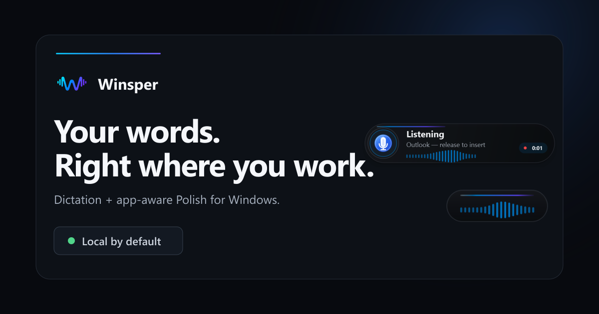

<p align="center">
  
</p>

<h1 align="center">Winsper</h1>

<p align="center">Speak where you type. Keep your voice, your words, and your flow.</p>

<p align="center">
  <a href="https://winsper.app/download/">Download for Windows</a> ·
  <a href="https://github.com/WinsperApp/winsper/releases/latest">Latest release</a> ·
  <a href="https://winsper.app/">winsper.app</a> ·
  <a href="docs/USAGE.md">Guide</a>
</p>

<p align="center">
  <a href="https://github.com/WinsperApp/winsper/actions/workflows/ci.yml"></a>
</p>

Hold a shortcut, speak, release. Winsper writes at your cursor without a copy-paste detour. Speech recognition runs on your PC. Optional Polish turns rough speech into ready-to-use text or changes text you select.

## One voice, two ways to write

- **Dictate:** Say it once. Winsper transcribes locally and inserts text in the focused app. Spoken formatting can add a new line, paragraph, Enter key, or today's date.
- **Polish, nothing selected:** Talk through an unfinished thought. Winsper cleans fillers, grammar, and punctuation while keeping your meaning. The destination app helps shape the result: email, chat, notes, or a coding tool.
- **Polish, text selected:** Highlight text, then say what you want changed—“make this shorter” or “turn this into bullets.” Winsper uses your selection as context and replaces that selection.

No special editor plugin. No account or API key for the default local path. Winsper works wherever Windows lets it capture a shortcut and insert text; app awareness guides formatting, not access to the rest of your screen.

## Made for the way you work

- **Fits your setup.** Pick Fast, Balanced, or Best speech and Polish quality. Download only models you choose; use CPU or supported local acceleration.
- **Remembers your words.** Personal corrections, custom terms, text shortcuts, and local History help with names, repeated phrases, and recovery.
- **Stays out of the way.** Full HUD, compact listening wave, or sound-only feedback. Optional start/stop chimes; configurable shortcuts and HUD position.
- **Keeps you in control.** Local speech and default Polish processing, no automatic telemetry upload, visible model downloads, and a Privacy page for local data. Ollama and custom model settings are optional.

Full HUD and compact HUD, rendered from the app's own interface:

<p align="center">
  
  
</p>

## Get started

1. Download the [Windows installer](https://winsper.app/download/) for Windows 10/11 x64.
2. Run setup, choose language and speech quality, and try the real Dictate shortcut. Model downloads need internet; everyday dictation then runs locally.
3. Enable Polish if you want local rewriting. Select text only when you want to change that text.

The current direct installer is **not code-signed**. Windows may show an *Unknown publisher* or SmartScreen warning. Verify the [published checksum](https://winsper.app/download/) and never disable antivirus protection to install Winsper. Bluetooth headphones can be used for playback, but Bluetooth hands-free microphone input is intentionally unsupported for safety.

Speech and default Polish processing stay on your PC. Model downloads, update checks, the website, and support may use the network. A remote model endpoint receives text only if you configure one. See [Privacy](https://winsper.app/privacy/) for details.

## Build from source

On Windows with Python 3.12 or 3.13 and PowerShell:

```powershell
.\scripts\setup.ps1
.\scripts\run.ps1
```

Run the deterministic tests with `.\scripts\test.ps1`. Hardware tests are separate and opt-in. See the [full guide](docs/USAGE.md) for shortcuts, model choices, configuration, troubleshooting, and the project layout.

## Project

- [Contributing](CONTRIBUTING.md) · [Report a security issue](SECURITY.md)
- [MIT license](LICENSE) · [Third-party and model terms](THIRD_PARTY_NOTICES.md) · [Code signing policy](CODE_SIGNING.md)
- [Download and checksum](https://winsper.app/download/)
