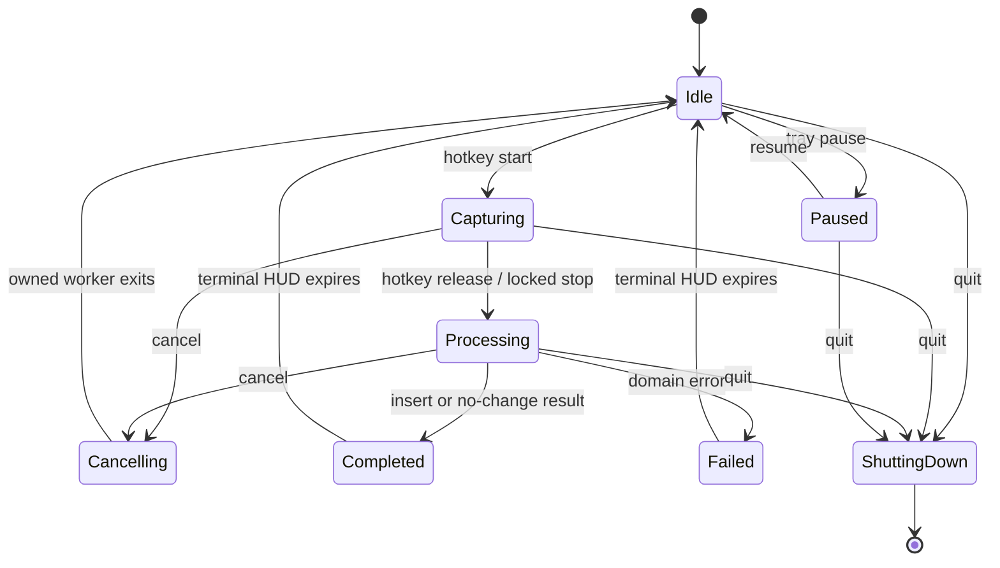

# Winsper Runtime Ownership

This document defines authority and shutdown rules for Winsper's native Windows runtime. It is a maintenance contract, not an aspirational redesign.

## Single-owner rule

`WinsperApp` is the coordinator. It alone may replace or close shared runtime components. A component may stop resources that it created internally, but it must not close another component's worker.

| Resource | Owner | May request work | May close/replace |
| --- | --- | --- | --- |
| Audio recorder and warm input stream | `WinsperApp` | lifecycle/hotkey path | `WinsperApp` |
| Isolated speech worker process | speech backend | `WinsperApp` | speech backend when instructed by `WinsperApp` |
| Rewrite server/backend | rewrite service | pipeline | rewrite service when instructed by `WinsperApp` |
| HUD process and queue | HUD controller | coordinator/state events | HUD controller when instructed by `WinsperApp` |
| Model preload thread | speech backend | `WinsperApp` | creator owns cancellation; coordinator joins during shutdown |
| Model download task | Settings model controller | Settings window | creating controller/window |
| Hotkey listener | `WinsperApp` | Windows keyboard hook | `WinsperApp` |
| Tray and owned windows | tray controller | user/coordinator | coordinator through tray shutdown |

## Action lifecycle

Every asynchronous callback carries an action identity. A late callback from an older action must be discarded and must never complete, fail, or update the HUD for a newer action.

## Shutdown order

1. Atomically reject new actions and mark shutdown in the action coordinator.
2. Stop the hotkey listener and tray commands that can create work.
3. Cancel capture, processing, preload, and model-download work through their owners.
4. Close recorder, speech, and rewrite resources. Independent slow closers may run concurrently.
5. Close HUD, Settings, history, onboarding, and tray-owned windows/processes.
6. Join bounded threads/processes; force-terminate only after the documented timeout.
7. Release the single-instance lock and exit.

Shutdown is idempotent: every closer must tolerate an already-closed resource. Best-effort UI cleanup may be logged and continued; audio, worker, config, and insertion failures must be surfaced or converted to a typed domain result.

## Configuration contract

- Current schema is `schema_version: 4`.
- Missing `schema_version` means the original public schema (v1).
- Migration is sequential, validated through the typed loader, backed up once per source schema, then atomically replaced.
- Unknown keys are preserved by migration. Existing user values are never replaced by defaults during migration.
- A future schema fails closed so an older Winsper build cannot damage newer settings.
- Normal Settings saves use the same process-wide write lock and atomic replacement path.
